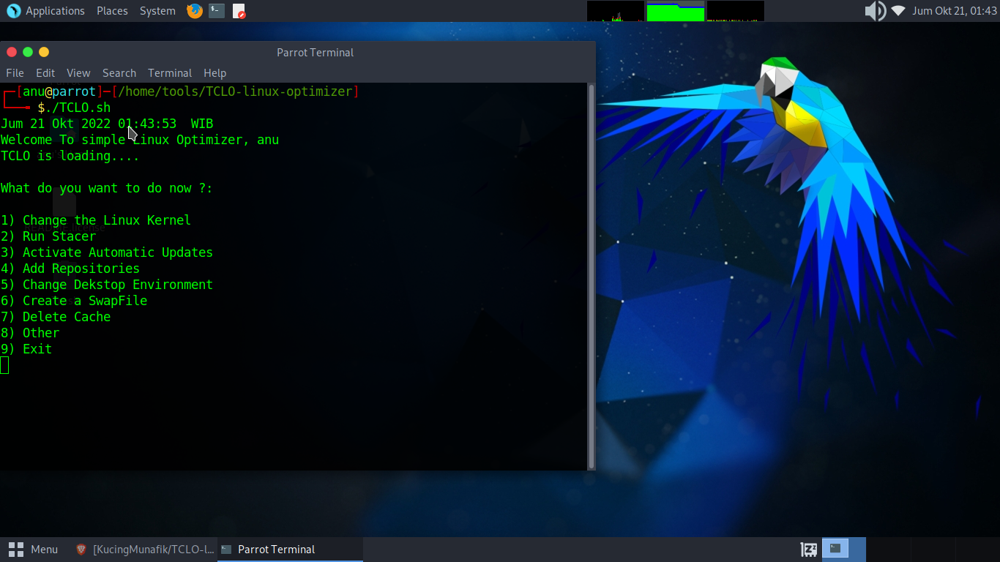

# TCLO-linux-optimizer
a simple CLI based linux optimizer for Thiv Linux OS

## What Is This

TCLO is a linux optimizer with a CLI interface created simply to make your linux machine configuration easier to do.
just copile it with GCC with the command below:

$ gcc -Wall -g TCLO.sh -o tclo

then, move it to /bin file in the filesystem directory
and run tclo in your terminal
